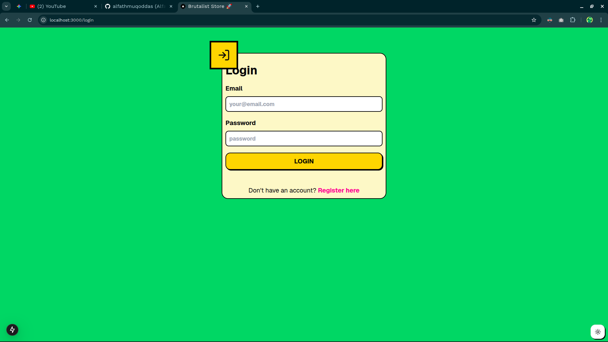
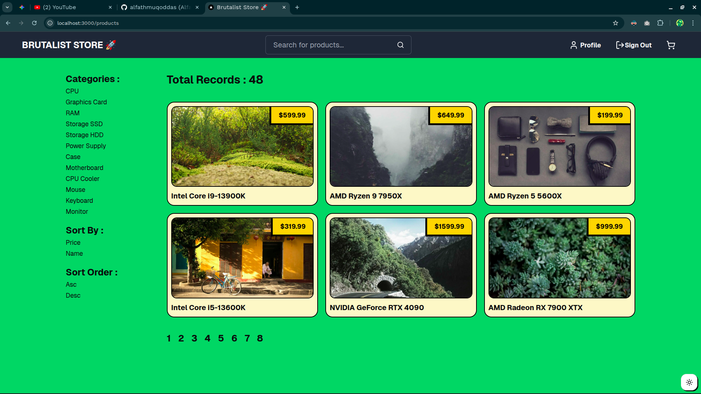
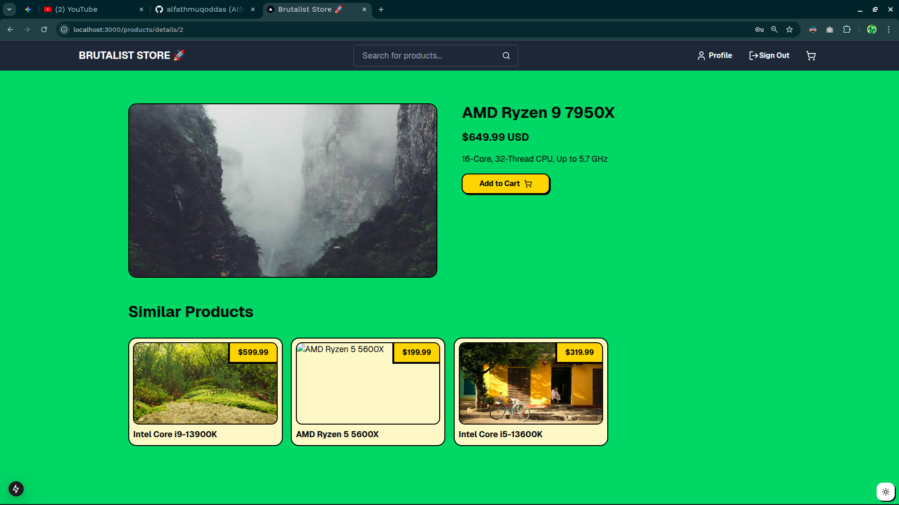

# Dinoland

The project name is Dinoland, but the app is actually a some sort of pcpartpicker app where user can pick parts and and adding those parts to their build. In this app user also able to add their own pc parts.

## Features

- Login/Register
- Product Page
- Product Detail Page
- Add to Cart
- Add to My Build
- Sorting
- Pagination
- Search

## Tech Stack

- [Next.js](https://nextjs.org)
- [Deno](https://deno.land)
- [Tailwind CSS](https://tailwindcss.com)
- [TypeScript](https://www.typescriptlang.org)

## Getting Started

First, run the development server:

```bash
npm run dev
# or
yarn dev
# or
pnpm dev
# or
bun dev
```

Open [http://localhost:3000](http://localhost:3000) with your browser to see the result.

## Screenshots




